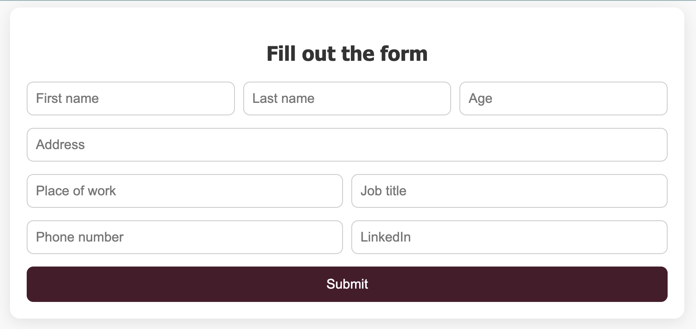
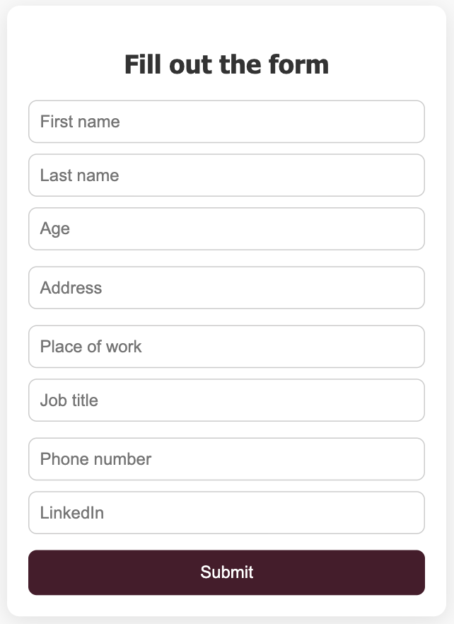

# Simple HTML/CSS Form

This is a clean, responsive form built using HTML and CSS. It includes fields for user details such as name, age, address, job information, and contact links.

## 🌐 Live Demo

You can view the deployed version [here](#)  
_Replace this link with your actual Vercel deployment URL._

## 🖼️ Screenshots

### 🖥️ Desktop View

### 📱 Mobile View

## 📁 Files

- `index.html` – Main HTML structure of the form.
- `index.css` – Styling for layout, spacing, responsiveness, and form elements.

## ✨ Features

- Responsive layout (mobile-friendly)
- Semantic HTML5 elements
- Accessible with `required` inputs and placeholders
- Customizable and easy to integrate

## 🚀 How to Use

1. Clone or download this repository.
2. Open `index.html` in your browser.
3. To deploy, upload the project to GitHub and connect it to [Vercel](https://vercel.com) or GitHub Pages.

## 🛠️ Customization

You can easily:

- Add or remove input fields
- Change styles in `index.css`
- Add functionality via JavaScript (e.g., form validation, submission logic)

## 📄 License

This project is open-source and available under the [MIT License](LICENSE).
